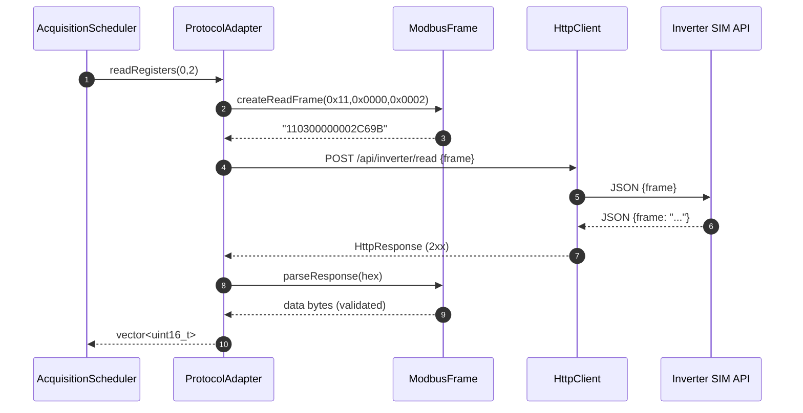
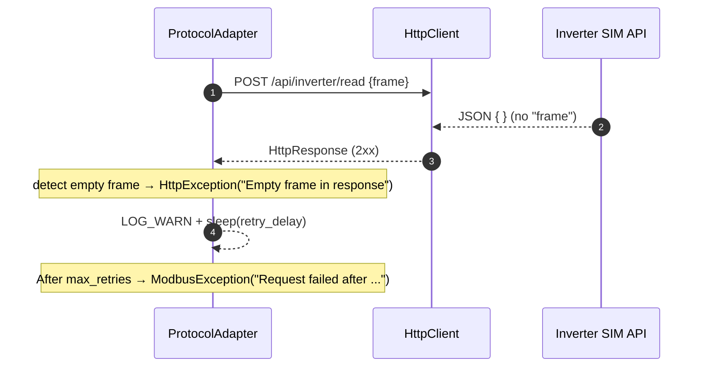

# API ↔ Implementation Mapping (EN4440 Inverter SIM)

This document maps the official API Service Documentation to the EcoWatt Device C++ implementation, showing exactly where each API behavior is handled in code and how to verify it.

Code modules:
- Protocol Adapter: `include/protocol_adapter.hpp`, `src/protocol_adapter.cpp`
- Modbus Frame: `include/modbus_frame.hpp`, `src/modbus_frame.cpp`
- HTTP Client: `include/http_client.hpp`, `src/http_client.cpp`
- Config: `include/config_manager.hpp`, `src/config_manager.cpp`
- Exceptions/Types: `include/exceptions.hpp`, `include/types.hpp`

---

## 1. Modbus RTU frames (format and CRC)

API doc reference: “Modbus Frame Introduction”

Our implementation follows the exact RTU layout:
- Request: `[Slave][Function][Data...][CRC Lo][CRC Hi]` (CRC16-Modbus, polynomial 0xA001, initial 0xFFFF, little‑endian in-frame)
- Response: same; read uses ByteCount; write echoes address+value; exception responses use `Function | 0x80` and carry an exception code.

Implementation points:
- Build frames: `ModbusFrame::createReadFrame`, `ModbusFrame::createWriteFrame`
- CRC: `ModbusFrame::calculateCRC` and `appendCRC` (push Lo then Hi)
- Parse/validate: `ModbusFrame::parseResponse`, `validateFrame`, `hexToBytes`, `bytesToHex`

CRC correspondence to API’s Java function: algorithm and little-endian output match exactly.

---

## 2. Read API mapping

API doc reference: “Read API”

- Endpoint: `http://20.15.114.131:8080/api/inverter/read`
- Method/Body: `POST { "frame": "<HEX>" }`
- Response: `200 OK { "frame": "<HEX>" }`, or blank frame on invalid request; exception frame for Modbus errors.

Implementation:
- `ProtocolAdapter::readRegisters(start, count)`
  - Builds 0x03 frame via `ModbusFrame::createReadFrame(slave, start, count)`
  - Sends using `sendRequest(api_config_.read_endpoint, frame_hex)`
  - Parses with `ModbusFrame::parseResponse(response_hex)`
  - Extracts 16-bit values with `parseRegisterValues()` (big‑endian words)
- HTTP transport: `HttpClient::post(endpoint, json)` sets headers, timeouts and returns `HttpResponse`
- Blank/invalid JSON: `sendRequest` throws on empty or invalid `frame` → retried per policy

Example parity with API:
- Example request in API: `{"frame":"110300000002C69B"}` – our code produces the same for `slave=0x11, start=0x0000, count=0x0002`.
- Example response body: `{"frame":"1103040904002A2870"}` – our parser will:
  - Validate CRC
  - Read `ByteCount=0x04`, then two registers: `0x0904` and `0x002A` (scaling applied later by acquisition using register `gain`)

---

## 3. Write API mapping

API doc reference: “Write API”

- Endpoint: `http://20.15.114.131:8080/api/inverter/write`
- Method/Body: `POST { "frame": "<HEX>" }`
- Response: echoes the same frame on success; blank on invalid frame; exception frame for Modbus errors.

Implementation:
- `ProtocolAdapter::writeRegister(addr, value)`
  - Builds 0x06 frame via `ModbusFrame::createWriteFrame(slave, addr, value)`
  - Sends using `sendRequest(api_config_.write_endpoint, frame_hex)`
  - Parses response and verifies echo (address/value) before returning `true`

Example parity with API:
- Example write body: `{"frame":"1106000800100B54"}` – our code produces the same for `slave=0x11, addr=0x0008, value=0x0010`.
- Response: identical frame; our adapter verifies address/value echo for safety.

---

## 4. Error handling and exception codes

API doc reference: “Error Codes and Meaning”

Modbus exception responses are detected in `ModbusFrame::parseResponse` when `function_code & 0x80` is set. We set `is_error=true`, capture `error_code`, and map with `getErrorMessage`:
- 0x01 Illegal Function
- 0x02 Illegal Data Address
- 0x03 Illegal Data Value
- 0x04 Slave Device Failure
- 0x05 Acknowledge
- 0x06 Slave Device Busy
- 0x08 Memory Parity Error
- 0x0A Gateway Path Unavailable
- 0x0B Gateway Target Device Failed to Respond

Adapter behavior:
- For exception frames, `ProtocolAdapter` throws `ModbusException(error_code, message)`; logged at ERROR.
- For blank response frames (API sends no frame), `sendRequest` treats as invalid JSON payload (no `frame`), logs WARN, retries, and finally throws `ModbusException` after `max_retries`.

---

## 5. Timeouts, retries, and logging (recovery)

API note: “If invalid frame → blank response” and real-world timeouts/errors are expected.

- Timeouts: `HttpClient` sets `CURLOPT_TIMEOUT_MS` (total) and `CURLOPT_CONNECTTIMEOUT_MS`.
- Retry policy: `ProtocolAdapter::sendRequest` retries on `HttpException` (including blank/invalid JSON) up to `modbus.max_retries`, sleeping `modbus.retry_delay` between attempts.
- Malformed/CRC/short frames: detected in `ModbusFrame::parseResponse`/`validateFrame` → `ModbusException` (not retried at the frame layer).
- Logging: TRACE frames (hex in/out), WARN on retry attempts, ERROR on final failures.

Config keys (via `.env` or `config.json`):
- `REQUEST_TIMEOUT_MS` → `ModbusConfig.timeout`
- `MAX_RETRIES` → `ModbusConfig.max_retries`
- `RETRY_DELAY_MS` → `ModbusConfig.retry_delay`

---

## 6. Endpoints, headers, and authentication

API doc reference: endpoints and header requirements.

- Base URL: `ApiConfig.base_url` (e.g., `http://20.15.114.131:8080`)
- Endpoints: `ApiConfig.read_endpoint` = `/api/inverter/read`, `ApiConfig.write_endpoint` = `/api/inverter/write`
- Headers:
  - `Authorization: <api key>` from `.env` `INVERTER_API_KEY`
  - `Content-Type: application/json`
  - `Accept: */*`

Implementation:
- `ProtocolAdapter` sets default headers into `HttpClient` during construction.
- `ConfigManager` loads `INVERTER_API_KEY` and `INVERTER_API_BASE_URL` from `.env` (overrides JSON).

---

## 7. Register map and scaling (from API registers table)

We align the register addresses, names, units, and scaling gains:

| Address | Name (example key) | Access | Gain | Unit | Notes |
|--------:|---------------------|--------|-----:|------|-------|
| 0 | Vac1_L1_Phase_voltage | Read | 10 | V | L1 Phase voltage (scaled = raw/10) |
| 1 | Iac1_L1_Phase_current | Read | 10 | A | L1 Phase current |
| 2 | Fac1_L1_Phase_frequency | Read | 100 | Hz | Frequency |
| 3 | Vpv1_PV1_input_voltage | Read | 10 | V | PV1 |
| 4 | Vpv2_PV2_input_voltage | Read | 10 | V | PV2 |
| 5 | Ipv1_PV1_input_current | Read | 10 | A | PV1 current |
| 6 | Ipv2_PV2_input_current | Read | 10 | A | PV2 current |
| 7 | Inverter_internal_temperature | Read | 10 | °C | Internal temp |
| 8 | Export_power_percentage | Read/Write | 1 | % | Writable (0–100) |
| 9 | Pac_L_Inverter_output_power | Read | 1 | W | Output power |

Implementation:
- Configured via `config.json` registers or `.env` overrides; available through `ConfigManager::getRegisterConfigs()`.
- Acquisition scaling: `AcquisitionScheduler::readSingleRegister` divides raw by `gain` to produce `scaled_value` and attaches `unit`.
- Write control: `EcoWattDevice::setExportPower(percentage)` writes to register 8 through `ProtocolAdapter` (validated echo).

---

## 8. Sequence diagram (API + implementation)



Error path (blank response):


---

## 9. Try it (PowerShell)

Ensure `.env` contains:
```powershell
# Required
INVERTER_API_KEY=<your api key>
INVERTER_API_BASE_URL=http://20.15.114.131:8080
```

Read example (matches API doc):
```powershell
$headers = @{ 'Authorization' = $env:INVERTER_API_KEY; 'Content-Type' = 'application/json'; 'accept' = '*/*' }
$body = @{ frame = '110300000002C69B' } | ConvertTo-Json
Invoke-RestMethod -Method Post -Uri 'http://20.15.114.131:8080/api/inverter/read' -Headers $headers -Body $body
```

Write example (matches API doc):
```powershell
$headers = @{ 'Authorization' = $env:INVERTER_API_KEY; 'Content-Type' = 'application/json'; 'accept' = '*/*' }
$body = @{ frame = '1106000800100B54' } | ConvertTo-Json
Invoke-RestMethod -Method Post -Uri 'http://20.15.114.131:8080/api/inverter/write' -Headers $headers -Body $body
```

---

## 10. Verification checklist

- Frame build parity: generated hex for 0x03/0x06 matches API examples (CRC little‑endian).
- Headers present: Authorization + JSON content type.
- Blank response handling: retried then ModbusException.
- Exception frames: mapped to friendly messages and surfaced as ModbusException.
- Register 8 write: echo verified; rejected values >100 handled by `EcoWattDevice::setExportPower`.
- Logging: TRACE frames, WARN on retries, ERROR on failures in `ecoWatt_milestone2.log`.

---

## 11. Resources and keys

- API Keys: set `INVERTER_API_KEY` in `.env`; never commit keys.
- Base URL: `INVERTER_API_BASE_URL` in `.env` (default comes from code if not set).

Authored for repository: `embedded-systems-engineering-m2` – API ↔ Implementation Mapping (Sept 2025).
