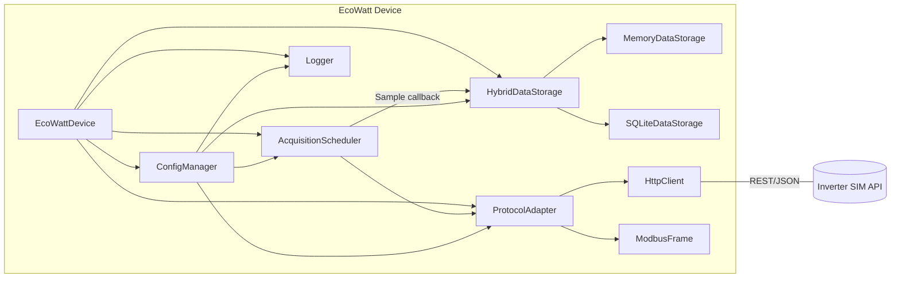
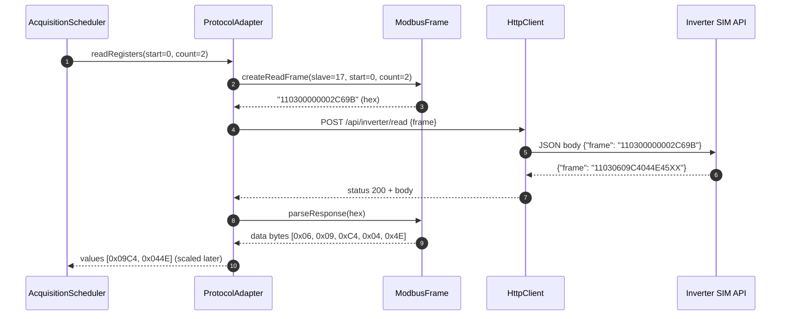
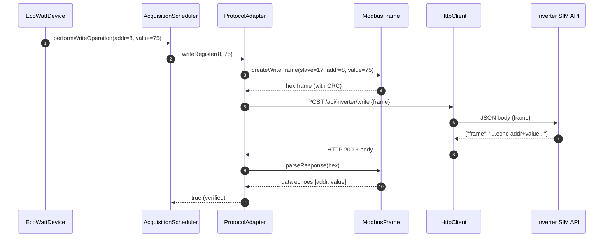
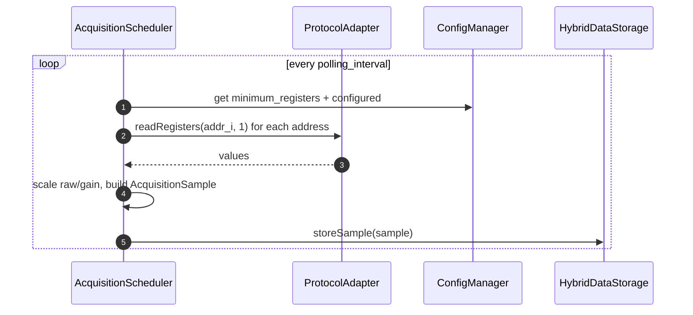

# EcoWatt Device – Milestone 2: Inverter SIM Integration and Basic Acquisition

This document explains, in depth, how the C++ implementation integrates with the Inverter SIM, formats Modbus requests, parses responses, schedules basic data acquisition, stores samples, performs writes, and handles errors and retries. It also includes architecture, sequence diagrams, data models, configuration, logging, and troubleshooting.

- Codebase path: `cpp/`
- Key components: Protocol Adapter, Modbus Framing, HTTP Client, Acquisition Scheduler, Data Storage (Memory + SQLite), Configuration Manager, Logging

## At-a-glance

- Protocol: Modbus RTU frames transported via HTTP JSON API to the Inverter SIM.
- Reads: Holding registers (0x03). Writes: Single register (0x06).
- Polling: Voltage (0) and Current (1) at configurable intervals; more registers can be added.
- Storage: Recent samples in memory; persistent archive in SQLite.
- Reliability: Timeouts, CRC checks, malformed frame detection, retries with backoff, structured logging.

---

## Related deep-dive

For a fully detailed Part 1 (Protocol Adapter) deep dive with error matrix, config mapping, and simulation tips, see:

- `ProtocolAdapter-Implementation-DeepDive.md`

---

## Component architecture



Key relationships:
- `EcoWattDevice` wires components and sets callbacks.
- `AcquisitionScheduler` polls registers via `ProtocolAdapter` and publishes samples.
- `ProtocolAdapter` builds/parses Modbus frames and transports over HTTP with retries.
- `HybridDataStorage` stores in memory and in SQLite.
- `ConfigManager` provides all runtime configuration; `.env` overrides `config.json`.

---

## End-to-end sequences

### Read registers (0x03)



Notes:
- The CRC is validated. Any mismatch raises a `ModbusException`.
- Error frames set `is_error=true` and carry `error_code`, mapped to friendly text.

### Write single register (0x06)



### Polling cycle (acquisition)



---

## Protocol adapter details

Files:
- `include/protocol_adapter.hpp`
- `src/protocol_adapter.cpp`
- Helpers: `include/modbus_frame.hpp`, `src/modbus_frame.cpp`, `include/http_client.hpp`, `src/http_client.cpp`

Responsibilities:
- Build Modbus RTU frames (0x03 and 0x06) and compute CRC (Modbus-RTU polynomial 0xA001).
- Validate responses: structure, CRC, function code, and error codes (0x80 bit).
- Transform data bytes into 16-bit register values (big‑endian for register content).
- Transport the hex frame inside JSON over HTTP; parse JSON responses and extract the returned hex frame.
- Implement retries with delay on transient HTTP/transport errors.
- Maintain `CommunicationStats` (success/failure, retries, average latency).

### Frames and CRC
- Read frame (example):
  - Input: slave=0x11 (17), function=0x03, start=0x0000, count=0x0002
  - Payload bytes: `11 03 00 00 00 02`
  - CRC16 (little‑endian) appended → `C6 9B`
  - Final hex: `110300000002C69B`
- Write frame: `11 06 [addr_hi addr_lo] [val_hi val_lo] [crc_lo crc_hi]`.
- CRC calculation: iterative XOR and right shifts with polynomial `0xA001` over all bytes before the CRC.

### Error handling
- HTTP errors (non-2xx, curl failures, invalid JSON) → `HttpException`, logged WARN/ERROR.
- Protocol errors (CRC fail, short frame, exception function, count mismatch) → `ModbusException`.
- Retry policy: up to `modbus.max_retries` with `modbus.retry_delay` between attempts; logs attempt number and last error.

### API contract to Inverter SIM
- Request: `POST {base_url}/api/inverter/{read|write}` with JSON body `{ "frame": "<HEX>" }`.
- Response: HTTP 200 JSON `{ "frame": "<HEX>" }`.
- Headers: `Authorization: <api_key>`, `Content-Type: application/json`, `Accept: */*`.

---

## Acquisition scheduler

Files:
- `include/acquisition_scheduler.hpp`
- `src/acquisition_scheduler.cpp`

Responsibilities:
- Background thread polling; interval from `acquisition.polling_interval_ms`.
- Minimum required registers (defaults include 0=Voltage, 1=Current) merged with configured set.
- Per-register scaling using `RegisterConfig.gain` (scaled = raw / gain).
- Emits `AcquisitionSample` to callbacks and maintains an internal recent buffer.
- Provides convenience reads (single/multiple) and write pass-through.

Optimization hooks:
- `groupConsecutiveRegisters()` computes contiguous chunks to batch reads; wiring this for combined reads is a natural next step.

---

## Data storage (memory + SQLite)

Files:
- `include/data_storage.hpp`
- `src/data_storage.cpp`

Layers:
- MemoryDataStorage: fast in-memory ring buffers per register with size caps.
- SQLiteDataStorage: persistent table `samples(register_address, value, timestamp)`, indexed by `(register_address, timestamp)`.
- HybridDataStorage: delegates to both (memory always; SQLite if enabled), and provides export stubs.

SQLite schema (created if missing):
- `samples(id, register_address, value, timestamp, created_at)` with indexes.
- `register_configs(register_address, name, unit, gain, description)`.

Retention/cleanup:
- A background cleanup task can remove old rows older than `storage.data_retention_days` (daily pass).

---

## Data models and statistics

Defined in `include/types.hpp`:

- `RegisterConfig { address, name, unit, gain, access, description }`
- `AcquisitionSample { timestamp, register_address, register_name, raw_value, scaled_value, unit }`
- `ModbusResponse { slave_address, function_code, data, is_error, error_code }`
- `AcquisitionStatistics { total_polls, successful_polls, failed_polls, last_poll_time, last_error }`
- `StorageStatistics { total_samples, samples_by_register, oldest/newest timestamps, storage_size_bytes }`
- `ModbusConfig { slave_address, timeout, max_retries, retry_delay }`
- `AcquisitionConfig { polling_interval, max_samples_per_register, minimum_registers, enable_background_polling }`
- `StorageConfig { memory_retention_samples, enable_persistent_storage, cleanup_interval, data_retention_days, database_path }`
- `ApiConfig { base_url, api_key, read_endpoint, write_endpoint, content_type, accept }`

---

## Configuration

Files:
- `include/config_manager.hpp`, `src/config_manager.cpp`
- Inputs: `config.json` (required), `.env` (optional; overrides JSON)

Precedence and keys:
- `.env` → overrides JSON → defaults from code.
- Important env vars:
  - `INVERTER_API_KEY`, `INVERTER_API_BASE_URL`
  - `DEFAULT_SLAVE_ADDRESS`, `MAX_RETRIES`, `REQUEST_TIMEOUT_MS`, `RETRY_DELAY_MS`
  - `DATABASE_PATH`, `LOG_LEVEL`, `LOG_FILE`
- `config.json` sections: `modbus`, `acquisition`, `storage`, `api.endpoints`, `api.headers`, `logging`, `registers`.
- Registers block maps address strings to metadata (name, unit, gain, access, description).

---

## Logging

Files: `include/logger.hpp`, `src/logger.cpp`
- Uses spdlog with two sinks: console (color) and rotating file.
- Levels per sink from `logging.console_level` / `logging.file_level`.
- Global macros: `LOG_TRACE/DEBUG/INFO/WARN/ERROR/CRITICAL`.
- Pattern defaults to `[%Y-%m-%d %H:%M:%S] [%l] %v`.

Example log lines:
- Protocol: frame creation/parsing at TRACE; retries at WARN; failures at ERROR.
- Acquisition: poll start/stop at INFO; per-sample callbacks at TRACE.
- Storage: inserts/logging of counts at DEBUG/INFO.

---

## Error handling and recovery

Error sources and responses:

- HTTP transport
  - Timeout, connection fail → retry up to `max_retries`; raise `HttpException` → wrapped into `ModbusException` by caller.
  - Non-2xx HTTP → `HttpException(code, body)`; logged WARN/ERROR; retried depending on type.
- Protocol
  - Invalid hex / CRC mismatch / short frame → `ModbusException`.
  - Modbus exception response (function|0x80) → `ModbusException(err_code, getErrorMessage(err_code))`.
- Acquisition
  - Read failure for a register logs error; cycle aggregates success/failure counts and last error text.

Backoff:
- Fixed delay `retry_delay` between attempts; logs attempt N and last error.

---

## Operational runbook (Windows PowerShell)

Prereqs:
- Visual Studio with C++ toolset; CMake ≥ 3.16; vcpkg dependencies already provided in repo build outputs.

Build (if needed):
```powershell
# From repo root
Set-Location cpp
if (-Not (Test-Path build)) { New-Item -ItemType Directory build | Out-Null }
Set-Location build
cmake .. -DCMAKE_TOOLCHAIN_FILE="C:/vcpkg/scripts/buildsystems/vcpkg.cmake"
cmake --build . --config Release
```

Run:
```powershell
# Ensure .env contains INVERTER_API_KEY and INVERTER_API_BASE_URL
# Run from cpp/build/Release if using CMake multi-config
./Release/EcoWattDevice.exe --demo
```

Common operations:
- Change polling interval at runtime: update `config.json` or call `EcoWattDevice::updateAcquisitionConfig` in code.
- Set export power: `EcoWattDevice::setExportPower(percentage)` → writes register 8.
- Export data: `EcoWattDevice::exportData("file.csv", "csv", Duration(ms))`.

---

## Data examples

- Scaling: if a voltage register has raw `2307` and `gain=10`, scaled voltage → `230.7 V`.
- Minimum registers: `[0, 1]` read each cycle; add more via `registers{ ... }` in `config.json`.

---

## Implementation hotspots (with file pointers)

- Protocol adapter
  - `ProtocolAdapter::readRegisters` and `writeRegister` → request/parse/verify and stats.
  - `ProtocolAdapter::sendRequest` → retries and JSON wrapping.
  - `ModbusFrame::createReadFrame`, `createWriteFrame`, `parseResponse`, `calculateCRC`.
- Acquisition
  - `AcquisitionScheduler::pollingLoop`, `performPollCycle`, `readSingleRegister` (gain scaling).
- Storage
  - `MemoryDataStorage::storeSample`, `getSamples`.
  - `SQLiteDataStorage` schema init and CRUD.
  - `HybridDataStorage` façade and (optional) cleanup task.
- Integration
  - `EcoWattDevice` wiring, callbacks, `setExportPower`, `getCurrentReadings`, `getSystemStatus`.
- Entrypoint
  - `main.cpp` banner, signal handling, demo mode (read status + write 75% → 50%).

---

## Known limitations and next steps

- Consecutive register batching is prepared but not yet used in polling; enabling grouped reads can reduce round-trips.
- Export to CSV/JSON functions are stubbed for demonstration; finalize formats for external analysis tooling.
- Per-error retry policy could be refined (e.g., no retry on 4xx responses).
- TLS verification is disabled by default; enable and configure CA bundle for production.

---

## Troubleshooting

- API key missing → `ConfigException("API key is required")`: ensure `.env` has `INVERTER_API_KEY`.
- Base URL invalid or unreachable → HTTP timeouts; verify `INVERTER_API_BASE_URL` and network.
- CRC validation failed → check SIM behavior and byte-order; enable TRACE logs for raw frames.
- No samples acquired → check minimum registers configured and device online; view `ecoWatt_milestone2.log`.

---

## Glossary

- Holding register: 16-bit register accessible via Modbus function 0x03.
- CRC16-Modbus: checksum algorithm for Modbus RTU frames (poly 0xA001, init 0xFFFF, little‑endian in frame).
- Gain: divisor for raw register scaling to engineering units.

---

Authored for repository: `embedded-systems-engineering-m2`, Milestone 2 (September 2025).
