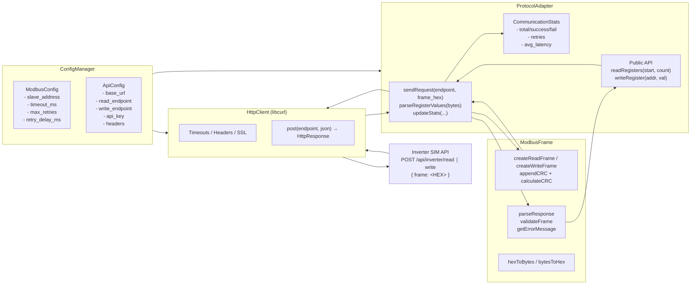
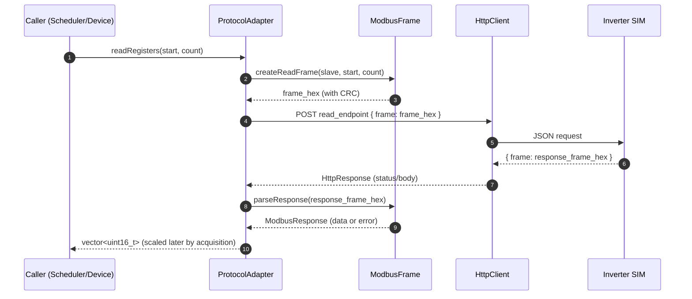
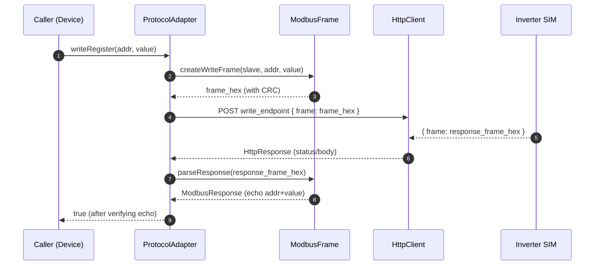
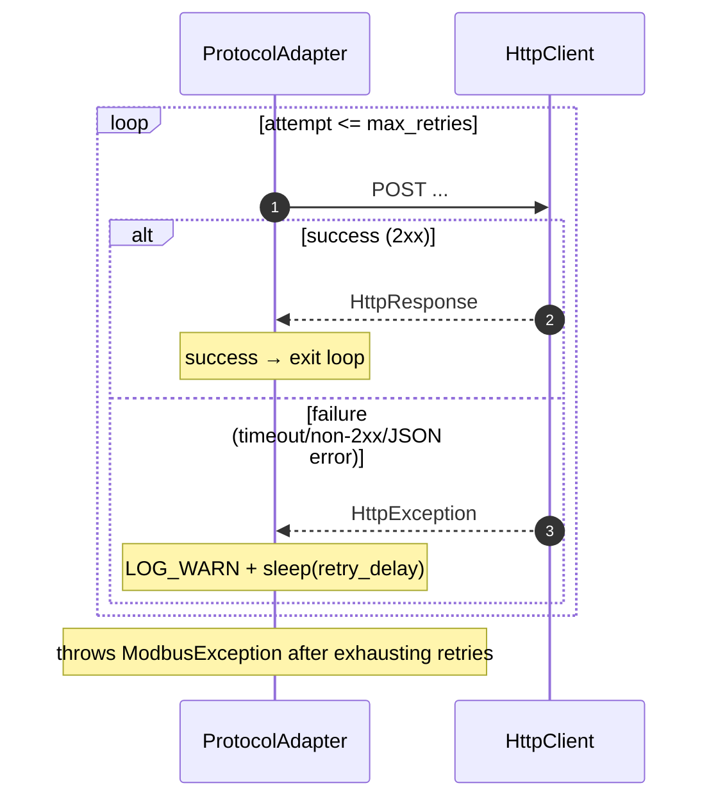

# Protocol Adapter Implementation – Deep Dive (Part 1)

Purpose: Document the Protocol Adapter internals for the EcoWatt Device, covering request formatting, response parsing, timeout/retry handling, logging, and simulation for the Inverter SIM.

Code paths:
- Adapter API: `cpp/include/protocol_adapter.hpp`, `cpp/src/protocol_adapter.cpp`
- Modbus framing: `cpp/include/modbus_frame.hpp`, `cpp/src/modbus_frame.cpp`
- HTTP transport: `cpp/include/http_client.hpp`, `cpp/src/http_client.cpp`
- Exceptions: `cpp/include/exceptions.hpp`
- Types/config: `cpp/include/types.hpp`, `cpp/include/config_manager.hpp`, `cpp/src/config_manager.cpp`

---

## 1) High-level architecture (Protocol path only)



---

## 2) Sequence flows

### 2.1 Read Holding Registers (0x03)



### 2.2 Write Single Register (0x06)



### 2.3 Retry on transient HTTP error



---

## 3) Modbus framing and parsing

### 3.1 PDU layouts

- Read Holding Registers (0x03) request:
  - Slave (1B), Function=0x03 (1B), Start Hi (1B), Start Lo (1B), Count Hi (1B), Count Lo (1B), CRC Lo (1B), CRC Hi (1B)
- Write Single Register (0x06) request:
  - Slave (1B), Function=0x06 (1B), Addr Hi (1B), Addr Lo (1B), Value Hi (1B), Value Lo (1B), CRC Lo, CRC Hi
- Read response:
  - Slave (1B), Function=0x03 (1B), ByteCount (1B), Data[...] (ByteCount B), CRC Lo, CRC Hi
- Error response:
  - Slave (1B), Function=(orig|0x80), Exception Code (1B), CRC Lo, CRC Hi

Notes:
- CRC16-Modbus polynomial 0xA001, init 0xFFFF; CRC stored little-endian (Lo, Hi).
- Register values are big-endian within data section (Hi, Lo per 16-bit register).

### 3.2 CRC algorithm (concept)

Pseudocode:
```
crc = 0xFFFF
for byte in data:
  crc ^= byte
  repeat 8 times:
    if (crc & 0x0001): crc = (crc >> 1) ^ 0xA001
    else:              crc =  crc >> 1
return crc
```

### 3.3 Validation steps in `parseResponse`
- Hex to bytes (`hexToBytes`) → throws `ValidationException` on bad hex.
- Length check (minimum 5 bytes) → else `ModbusException`.
- CRC check (`validateFrame`) → else `ModbusException`.
- Error function detection (function & 0x80) → set `is_error`, record `error_code`.
- Data extraction based on function (0x03 uses ByteCount; 0x06 echoes address+value).

---

## 4) Timeouts, retries, and error handling

### 4.1 Sources of failure
- Transport: DNS/connect timeout, TLS fail, non-2xx HTTP, invalid/empty JSON body, missing `frame` property.
- Protocol: invalid hex, short frame, CRC mismatch, Modbus exception function (0x80), register count mismatch.

### 4.2 Handling strategy
- `HttpClient::post`
  - Sets curl timeouts; on curl error → `HttpException` with message.
  - Populates `HttpResponse.status_code/body`; non-2xx flagged.
- `ProtocolAdapter::sendRequest`
  - Retries on `HttpException` up to `max_retries`, sleeping `retry_delay` between attempts; logs WARN per attempt.
  - Parses JSON and extracts `frame`; invalid JSON → `HttpException` → retry.
  - After retries exhausted → throw `ModbusException` with last error.
- `ModbusFrame::parseResponse`
  - Any validation failure → `ModbusException` with message; caller logs and records failure.

### 4.3 Error matrix

| Layer | Condition | Exception | Logged | Retry? |
|------|-----------|-----------|--------|--------|
| HTTP | Timeout/curl error | HttpException | WARN/ERROR | Yes (sendRequest) |
| HTTP | Non-2xx status | HttpException(code, body) | WARN | Yes (sendRequest) |
| HTTP | Invalid JSON / empty frame | HttpException | WARN | Yes (sendRequest) |
| Frame | Bad hex | ModbusException | ERROR | No |
| Frame | Too short | ModbusException | ERROR | No |
| Frame | CRC mismatch | ModbusException | DEBUG/ERROR | No |
| Frame | Exception function | ModbusException(code) | ERROR | No |
| Adapter | Count mismatch | ModbusException | ERROR | No |

---

## 5) Logging map

- TRACE: raw frames (created/sent/received), HTTP req/resp, detailed parsing events.
- DEBUG: build/parse summaries, timing, CRC mismatch details, headers set, timeout changes.
- INFO: adapter init, communication tests, overall operation milestones.
- WARN: retry attempts, non-2xx HTTP responses.
- ERROR: final failures, exceptions thrown to callers.

Log macros: `LOG_TRACE`, `LOG_DEBUG`, `LOG_INFO`, `LOG_WARN`, `LOG_ERROR` (via spdlog).

---

## 6) Configuration mapping

| Source | Key | Code field | Purpose |
|--------|-----|------------|---------|
| `.env` | INVERTER_API_KEY | ApiConfig.api_key | Authorization header value |
| `.env` | INVERTER_API_BASE_URL | ApiConfig.base_url | API host |
| `.env` | REQUEST_TIMEOUT_MS | ModbusConfig.timeout | HTTP total timeout |
| `.env` | MAX_RETRIES | ModbusConfig.max_retries | Retry attempts in adapter |
| `.env` | RETRY_DELAY_MS | ModbusConfig.retry_delay | Sleep between retries |
| JSON `api.endpoints` | read/write | ApiConfig.read_endpoint / write_endpoint | Paths |
| JSON `api.headers` | content_type/accept | ApiConfig.content_type / accept | Headers |

Note: `.env` overrides JSON values in `ConfigManager`.

---

## 7) Simulation (when SIM is unavailable)

### 7.1 Local mock server (Python Flask example)

```python
from flask import Flask, request, jsonify
app = Flask(__name__)

# Echo back a simple, valid Modbus read response for 2 registers
# Request body: {"frame":"110300000002C69B"}
@app.post('/api/inverter/read')
def read():
    req = request.get_json(force=True)
    # Return a fixed response frame (hex) with correct CRC for demo
    return jsonify(frame="11030609C4044EE95D")

@app.post('/api/inverter/write')
def write():
    req = request.get_json(force=True)
    # For simplicity, echo the same frame (pretend device accepted write)
    return jsonify(frame=req['frame'])

if __name__ == '__main__':
    app.run(host='0.0.0.0', port=8080)
```

- Point `INVERTER_API_BASE_URL=http://127.0.0.1:8080` in `.env`.
- Use real frames from `ModbusFrame::create*` to keep CRC valid, or ensure your mock returns CRC-correct frames.

### 7.2 Adapter test hook
- Optionally introduce a build-time flag (e.g., `SIMULATION_MODE`) to swap `HttpClient` with a stub that returns canned JSON `{"frame" : "..."}`.

---

## 8) Test plan (Part 1)

- Happy paths
  - Read 2 registers from start 0 → vector size 2; ensure scaled values in acquisition step are correct with configured `gain`.
  - Write register 8 → response echoes addr/value; verify `true`.
- Error paths
  - Invalid JSON (mock returns `{}`) → retried until max; final `ModbusException`.
  - HTTP 500/timeout → retried; final failure after `max_retries`.
  - Malformed hex (odd length) → `ModbusException` from frame parser.
  - CRC mismatch → `ModbusException`; ensure logs include both CRCs.
  - Modbus exception (function|0x80) → `ModbusException(code)`; verify message from `getErrorMessage`.
- Metrics
  - Verify `CommunicationStats` counters for total/success/fail/retries and average latency update.

---

## 9) Risks and edge cases

- Large `count` (>125) rejected by `readRegisters`.
- Byte order mistakes (CRC is little-endian; register data is big-endian) cause CRC failures or wrong values.
- Retrying on non-retriable errors (e.g., 4xx) could be optimized in future (skip retries for client errors).
- TLS verification is disabled by default; enable for production and provide CA bundle.

---

## 10) Implementation pointers

- Entry: `ProtocolAdapter::readRegisters`/`writeRegister` → create frame → `sendRequest` → parse → verify/convert.
- Retry core: `sendRequest` loop with `modbus_config_.max_retries` and `retry_delay`.
- Frame math: `calculateCRC` and `appendCRC` (push Lo then Hi byte), `validateFrame` (recompute and compare).
- Parsing: remove error bit, route by function, and slice data excluding CRC bytes.

---

## 11) Quick verification (manual)

- Enable TRACE logs (in `config.json`: `logging.console_level = "TRACE"`).
- Run the app with mock server as base_url.
- Confirm logs show:
  - Created frame hex
  - POST with JSON
  - Response frame hex
  - Parsed values or error code
  - Retry messages on simulated failures

---

Authored for repository: `embedded-systems-engineering-m2` – Part 1 Deep Dive (September 2025).
