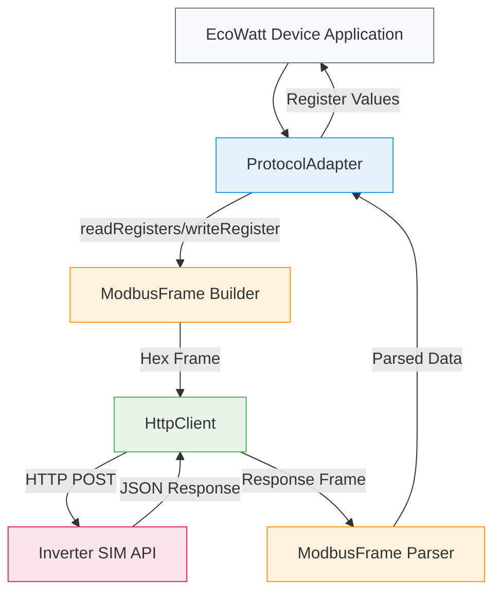
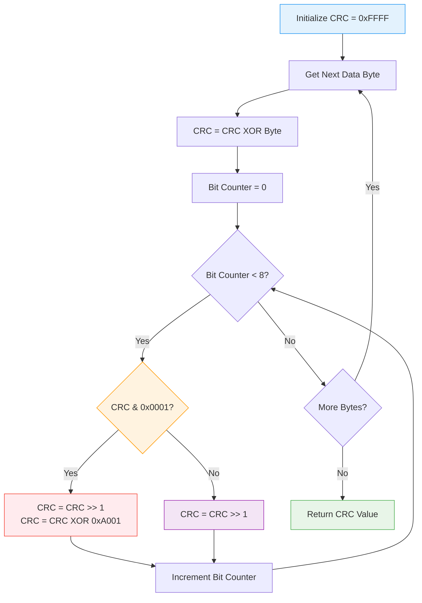
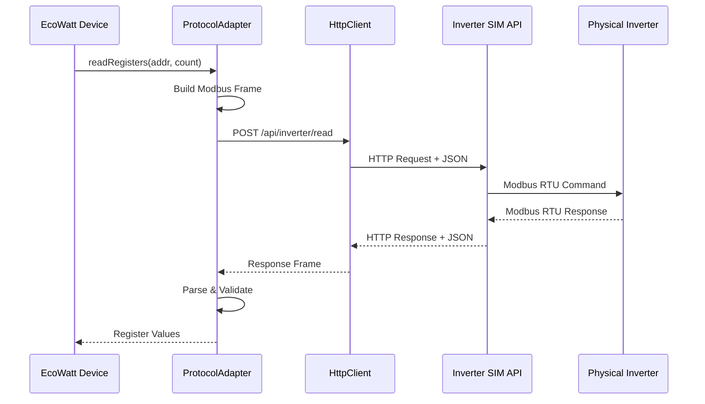
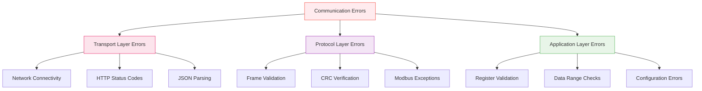
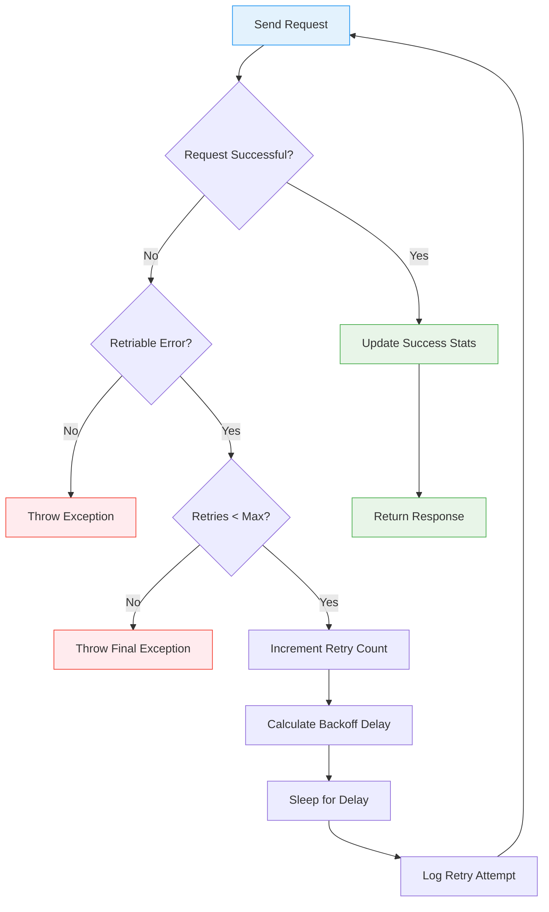
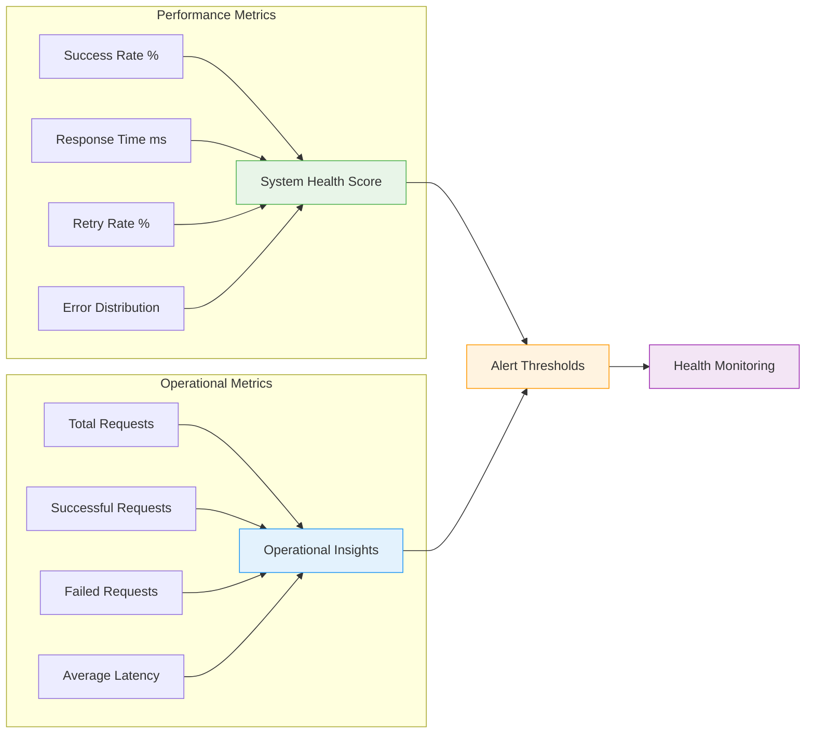
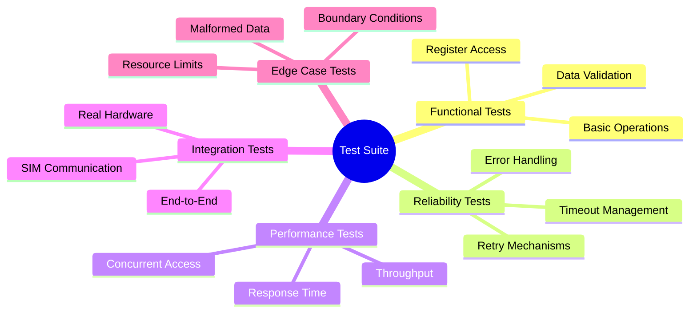
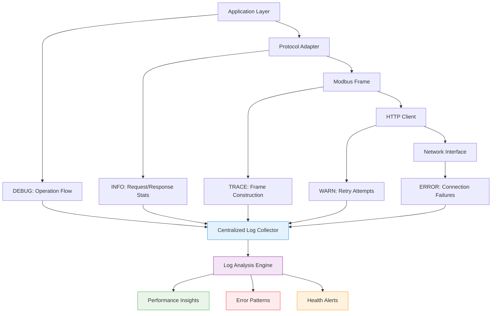
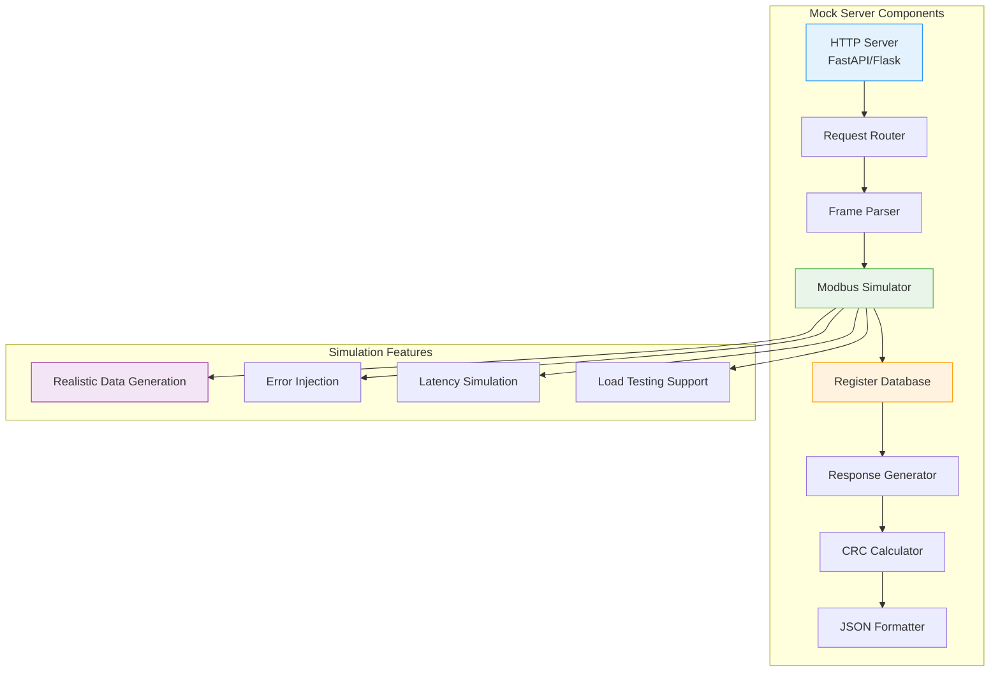
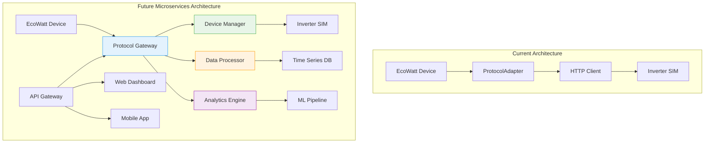

# Short Protocol Documentation and Test Scenarios

## Overview

This document provides comprehensive documentation for the EcoWatt Device's short protocol implementation, which enables communication with inverter devices using the Modbus RTU protocol over HTTP. The protocol adapter implements a robust communication layer with built-in error handling, retry mechanisms, and comprehensive logging.

---

## 1. Protocol Stack Architecture

### 1.1 Communication Architecture



### 1.2 Key Components

| Component | Purpose | File Location |
|-----------|---------|---------------|
| `ProtocolAdapter` | Main protocol interface and communication logic | `include/protocol_adapter.hpp`, `src/protocol_adapter.cpp` |
| `ModbusFrame` | Modbus RTU frame construction and parsing | `include/modbus_frame.hpp`, `src/modbus_frame.cpp` |
| `HttpClient` | HTTP transport using libcurl | `include/http_client.hpp`, `src/http_client.cpp` |
| `ConfigManager` | Configuration management | `include/config_manager.hpp`, `src/config_manager.cpp` |

---

## 2. Modbus RTU Protocol Implementation

### 2.1 Supported Function Codes

| Function Code | Hex | Description | Implementation Status |
|---------------|-----|-------------|----------------------|
| Read Holding Registers | 0x03 | Read multiple 16-bit registers | ✅ Implemented |
| Write Single Register | 0x06 | Write single 16-bit register | ✅ Implemented |

### 2.2 Modbus RTU Frame Structure

The EcoWatt Device implements Modbus RTU protocol encapsulated within HTTP JSON payloads. All frames follow the standard Modbus RTU format with proper CRC-16 validation.

#### 2.2.1 General Frame Format

```
┌─────────────┬─────────────┬─────────────────────────┬─────────────┬─────────────┐
│ Slave Addr  │ Function    │ Data Field              │ CRC Low     │ CRC High    │
│ (1 byte)    │ Code        │ (Variable Length)       │ (1 byte)    │ (1 byte)    │
│             │ (1 byte)    │                         │             │             │
└─────────────┴─────────────┴─────────────────────────┴─────────────┴─────────────┘
```

#### 2.2.2 Read Holding Registers (Function Code 0x03)

**Request Frame:**
```
┌─────────────┬─────────────┬─────────────┬─────────────┬─────────────┬─────────────┬─────────────┬─────────────┐
│ Slave Addr  │ Func Code   │ Start Addr  │ Start Addr  │ Reg Count   │ Reg Count   │ CRC Low     │ CRC High    │
│ (1 byte)    │ 0x03        │ High Byte   │ Low Byte    │ High Byte   │ Low Byte    │ (1 byte)    │ (1 byte)    │
│             │ (1 byte)    │ (1 byte)    │ (1 byte)    │ (1 byte)    │ (1 byte)    │             │             │
└─────────────┴─────────────┴─────────────┴─────────────┴─────────────┴─────────────┴─────────────┴─────────────┘
```

**Response Frame:**
```
┌─────────────┬─────────────┬─────────────┬─────────────────────────┬─────────────┬─────────────┐
│ Slave Addr  │ Func Code   │ Byte Count  │ Register Data           │ CRC Low     │ CRC High    │
│ (1 byte)    │ 0x03        │ (1 byte)    │ (N bytes, 2 per reg)   │ (1 byte)    │ (1 byte)    │
│             │ (1 byte)    │             │                         │             │             │
└─────────────┴─────────────┴─────────────┴─────────────────────────┴─────────────┴─────────────┘
```

#### 2.2.3 Write Single Register (Function Code 0x06)

**Request Frame:**
```
┌─────────────┬─────────────┬─────────────┬─────────────┬─────────────┬─────────────┬─────────────┬─────────────┐
│ Slave Addr  │ Func Code   │ Reg Addr    │ Reg Addr    │ Reg Value   │ Reg Value   │ CRC Low     │ CRC High    │
│ (1 byte)    │ 0x06        │ High Byte   │ Low Byte    │ High Byte   │ Low Byte    │ (1 byte)    │ (1 byte)    │
│             │ (1 byte)    │ (1 byte)    │ (1 byte)    │ (1 byte)    │ (1 byte)    │             │             │
└─────────────┴─────────────┴─────────────┴─────────────┴─────────────┴─────────────┴─────────────┴─────────────┘
```

**Response Frame (Echo):**
```
┌─────────────┬─────────────┬─────────────┬─────────────┬─────────────┬─────────────┬─────────────┬─────────────┐
│ Slave Addr  │ Func Code   │ Reg Addr    │ Reg Addr    │ Reg Value   │ Reg Value   │ CRC Low     │ CRC High    │
│ (1 byte)    │ 0x06        │ High Byte   │ Low Byte    │ High Byte   │ Low Byte    │ (1 byte)    │ (1 byte)    │
│             │ (1 byte)    │ (1 byte)    │ (1 byte)    │ (1 byte)    │ (1 byte)    │             │             │
└─────────────┴─────────────┴─────────────┴─────────────┴─────────────┴─────────────┴─────────────┴─────────────┘
```

#### 2.2.4 Error Response Frame

```
┌─────────────┬─────────────┬─────────────┬─────────────┬─────────────┐
│ Slave Addr  │ Error Code  │ Exception   │ CRC Low     │ CRC High    │
│ (1 byte)    │ (Func|0x80) │ Code        │ (1 byte)    │ (1 byte)    │
│             │ (1 byte)    │ (1 byte)    │             │             │
└─────────────┴─────────────┴─────────────┴─────────────┴─────────────┘
```

### 2.3 CRC-16 Modbus Calculation

The EcoWatt Device implements the standard CRC-16 Modbus algorithm for frame integrity verification.

#### 2.3.1 CRC Parameters
- **Polynomial**: `0xA001` (reversed representation of `0x8005`)
- **Initial Value**: `0xFFFF`
- **Byte Order**: Little-endian (LSB transmitted first)
- **Width**: 16 bits

#### 2.3.2 CRC Calculation Flow



---

## 3. HTTP Transport Layer

### 3.1 HTTP Transport Protocol

The EcoWatt Device communicates with the Inverter SIM using RESTful HTTP API calls. All Modbus frames are encapsulated within JSON payloads for transmission over the network.

#### 3.1.1 Communication Sequence



#### 3.1.2 Request Format

All HTTP requests use the `POST` method with JSON content type:

```http
POST /api/inverter/read HTTP/1.1
Host: 20.15.114.131:8080
Content-Type: application/json
Accept: */*
Authorization: Bearer <API_KEY>

{
    "frame": "110300000002C69B"
}
```

#### 3.1.3 Response Format

Successful responses return HTTP 200 with JSON payload:

```http
HTTP/1.1 200 OK
Content-Type: application/json

{
    "frame": "11030409C4044EE95D"
}
```

### 3.2 API Endpoints

| Endpoint | Method | Purpose | Request Body |
|----------|--------|---------|--------------|
| `/api/inverter/read` | POST | Read operations | `{"frame": "<hex_string>"}` |
| `/api/inverter/write` | POST | Write operations | `{"frame": "<hex_string>"}` |

### 3.3 HTTP Headers
```
Content-Type: application/json
Accept: */*
Authorization: Bearer <API_KEY>  (if configured)
```

---

## 4. Configuration

### 4.1 Modbus Configuration
```json
{
  "modbus": {
    "slave_address": 17,
    "timeout_ms": 5000,
    "max_retries": 3,
    "retry_delay_ms": 1000
  }
}
```

### 4.2 API Configuration
```json
{
  "api": {
    "endpoints": {
      "read": "/api/inverter/read",
      "write": "/api/inverter/write"
    },
    "headers": {
      "content_type": "application/json",
      "accept": "*/*"
    }
  }
}
```

### 4.3 Environment Variables
```bash
INVERTER_API_BASE_URL=http://20.15.114.131:8080
INVERTER_API_KEY=your_api_key_here
REQUEST_TIMEOUT_MS=5000
MAX_RETRIES=3
RETRY_DELAY_MS=1000
```

---

## 5. Error Handling and Recovery

### 5.1 Error Classification and Handling Strategy

The EcoWatt Device implements a comprehensive error handling strategy with multiple layers of validation and recovery mechanisms.

#### 5.1.1 Error Hierarchy



### 5.2 Modbus Exception Codes

| Code | Hex | Name | Description |
|------|-----|------|-------------|
| 1 | 0x01 | Illegal Function | Function code not supported |
| 2 | 0x02 | Illegal Data Address | Register address not valid |
| 3 | 0x03 | Illegal Data Value | Value not acceptable |
| 4 | 0x04 | Slave Device Failure | Unrecoverable error in slave |
| 5 | 0x05 | Acknowledge | Long duration command accepted |
| 6 | 0x06 | Slave Device Busy | Slave busy, retry later |
| 8 | 0x08 | Memory Parity Error | Memory error detected |
| 10 | 0x0A | Gateway Path Unavailable | Gateway path not available |
| 11 | 0x0B | Gateway Target Failed | Gateway target device failed |

### 5.3 Adaptive Retry Strategy

The ProtocolAdapter implements an intelligent retry mechanism with exponential backoff and circuit breaker patterns.



#### 5.3.1 Retry Configuration Parameters

```cpp
struct RetryConfig {
    uint32_t max_retries = 3;           // Maximum retry attempts
    Duration base_delay = Duration(1000); // Base retry delay (1s)
    double backoff_multiplier = 1.5;    // Exponential backoff factor
    Duration max_delay = Duration(30000); // Maximum delay cap (30s)
    bool enable_jitter = true;          // Add random jitter
};
```

---

## 6. Register Map and Data Types

### 6.1 Supported Registers

| Address | Name | Unit | Access | Gain | Description |
|---------|------|------|--------|------|-------------|
| 0 | Vac1_L1_Phase_voltage | V | Read | 10.0 | L1 Phase voltage |
| 1 | Iac1_L1_Phase_current | A | Read | 10.0 | L1 Phase current |
| 2 | Fac1_L1_Phase_frequency | Hz | Read | 100.0 | L1 Phase frequency |
| 3 | Vpv1_PV1_input_voltage | V | Read | 10.0 | PV1 input voltage |
| 4 | Vpv2_PV2_input_voltage | V | Read | 10.0 | PV2 input voltage |
| 5 | Ipv1_PV1_input_current | A | Read | 10.0 | PV1 input current |
| 6 | Ipv2_PV2_input_current | A | Read | 10.0 | PV2 input current |
| 7 | Inverter_internal_temperature | °C | Read | 10.0 | Internal temperature |
| 8 | Export_power_percentage | % | Read/Write | 1.0 | Export power setting |
| 9 | Pac_L_Inverter_output_power | W | Read | 1.0 | Current output power |

### 6.2 Data Scaling
Raw register values are scaled using the gain factor:
```cpp
scaled_value = raw_value / gain
```

---

## 7. Communication Statistics

### 7.1 Performance Metrics and KPIs

The EcoWatt Device tracks comprehensive communication statistics to monitor system health and performance.

#### 7.1.1 Key Performance Indicators



#### 7.1.2 Statistics Data Structure

```cpp
/**
 * @brief Communication performance and reliability statistics
 */
struct CommunicationStats {
    // Request counters
    uint64_t total_requests = 0;        ///< Total requests attempted
    uint64_t successful_requests = 0;   ///< Successfully completed requests
    uint64_t failed_requests = 0;       ///< Failed requests (after all retries)
    uint64_t retry_attempts = 0;        ///< Total retry attempts across all requests
    
    // Timing metrics
    Duration average_response_time = Duration(0);  ///< Mean response time
    Duration min_response_time = Duration(0);      ///< Fastest response time
    Duration max_response_time = Duration(0);      ///< Slowest response time
    
    // Error categorization
    std::map<std::string, uint64_t> error_counts;  ///< Error type frequency
    
    // Calculated metrics
    double success_rate() const {
        return total_requests > 0 ? 
            static_cast<double>(successful_requests) / total_requests : 0.0;
    }
    
    double retry_rate() const {
        return total_requests > 0 ? 
            static_cast<double>(retry_attempts) / total_requests : 0.0;
    }
};
```

### 7.2 Performance Monitoring
- **Response Time**: Measured from request start to successful response
- **Success Rate**: Percentage of successful requests
- **Retry Rate**: Number of retry attempts per request
- **Error Distribution**: Categorized by error type

---

## 8. Comprehensive Test Suite

The EcoWatt Device protocol implementation includes an extensive test suite covering functional, integration, performance, and edge-case scenarios.

### 8.1 Test Categories Overview



### 8.2 Functional Test Cases

#### 8.2.1 Basic Register Operations

**Test Case F001: Single Register Read**
```cpp
/**
 * @brief Verify single register read operation
 * @test_id F001
 * @priority High
 * @category Functional
 */
TEST(ProtocolAdapterTest, ReadSingleRegister) {
    // Setup
    ProtocolAdapter adapter(createTestConfig());
    const RegisterAddress voltage_register = 0;
    
    // Execute
    std::vector<RegisterValue> values = adapter.readRegisters(voltage_register, 1);
    
    // Verify
    ASSERT_EQ(values.size(), 1) << "Expected exactly one register value";
    ASSERT_GT(values[0], 0) << "Voltage value should be positive";
    ASSERT_LT(values[0], 65535) << "Value should be within 16-bit range";
    
    // Log for analysis
    LOG_INFO("Read register {}: raw={}, scaled={:.2f}V", 
             voltage_register, values[0], values[0] / 10.0);
}
```

**Test Case F002: Multiple Register Read**
```cpp
/**
 * @brief Verify multiple register read operation
 * @test_id F002
 * @priority High
 * @category Functional
 */
TEST(ProtocolAdapterTest, ReadMultipleRegisters) {
    // Setup
    ProtocolAdapter adapter(createTestConfig());
    const RegisterAddress start_address = 0;
    const uint16_t register_count = 5;
    
    // Execute
    std::vector<RegisterValue> values = adapter.readRegisters(start_address, register_count);
    
    // Verify
    ASSERT_EQ(values.size(), register_count) << "Register count mismatch";
    
    // Validate each register contains reasonable values
    for (size_t i = 0; i < values.size(); ++i) {
        ASSERT_GE(values[i], 0) << "Register " << i << " value out of range";
        ASSERT_LE(values[i], 65535) << "Register " << i << " exceeds 16-bit limit";
    }
}
```

**Test Case F003: Write Register Operation**
```cpp
/**
 * @brief Verify write register operation with verification
 * @test_id F003
 * @priority High
 * @category Functional
 */
TEST(ProtocolAdapterTest, WriteRegisterWithVerification) {
    // Setup
    ProtocolAdapter adapter(createTestConfig());
    const RegisterAddress export_power_register = 8;
    const RegisterValue test_value = 75;  // 75% export power
    
    // Get original value for restoration
    RegisterValue original_value = adapter.readRegisters(export_power_register, 1)[0];
    
    // Execute write operation
    ASSERT_TRUE(adapter.writeRegister(export_power_register, test_value))
        << "Write operation failed";
    
    // Verify write by reading back
    RegisterValue written_value = adapter.readRegisters(export_power_register, 1)[0];
    ASSERT_EQ(written_value, test_value) 
        << "Written value does not match expected value";
    
    // Cleanup: restore original value
    ASSERT_TRUE(adapter.writeRegister(export_power_register, original_value))
        << "Failed to restore original value";
}
```

### 8.2 Error Handling Tests

#### Test Case 4: Invalid Register Address
```cpp
// Test reading non-existent register
ASSERT_THROW(adapter.readRegisters(999, 1), ModbusException);
```

#### Test Case 5: Invalid Register Count
```cpp
// Test reading too many registers
ASSERT_THROW(adapter.readRegisters(0, 126), ModbusException);
```

#### Test Case 6: Network Timeout
```cpp
// Configure short timeout
ConfigManager config;
config.setRequestTimeout(100); // 100ms
ProtocolAdapter adapter(config);
// Test with unreachable endpoint
ASSERT_THROW(adapter.readRegisters(0, 1), ModbusException);
```

### 8.3 Communication Reliability Tests

#### Test Case 7: Retry Mechanism
```cpp
// Simulate intermittent failures
MockHttpClient mock;
mock.setFailureRate(0.7); // 70% failure rate
ProtocolAdapter adapter(config);
// Should eventually succeed with retries
std::vector<RegisterValue> values = adapter.readRegisters(0, 1);
ASSERT_EQ(values.size(), 1);
```

#### Test Case 8: Statistics Tracking
```cpp
// Perform multiple operations
adapter.readRegisters(0, 2);
adapter.writeRegister(8, 50);
adapter.readRegisters(3, 3);

const auto& stats = adapter.getStatistics();
ASSERT_EQ(stats.total_requests, 3);
ASSERT_TRUE(stats.success_rate() > 0.0);
```

### 8.4 Frame Validation Tests

#### Test Case 9: CRC Validation
```cpp
// Test with corrupted frame
std::string corrupted_frame = "110300000002C69C"; // Wrong CRC
ASSERT_THROW(ModbusFrame::parseResponse(corrupted_frame), ModbusException);
```

#### Test Case 10: Malformed Hex
```cpp
// Test with invalid hex characters
std::string invalid_hex = "11030000000ZC69B";
ASSERT_THROW(ModbusFrame::parseResponse(invalid_hex), ModbusException);
```

#### Test Case 11: Short Frame
```cpp
// Test with frame too short
std::string short_frame = "1103";
ASSERT_THROW(ModbusFrame::parseResponse(short_frame), ModbusException);
```

### 8.5 Protocol Compliance Tests

#### Test Case 12: Frame Format Verification
```cpp
// Test read frame creation
std::string frame = ModbusFrame::createReadFrame(17, 0, 2);
std::vector<uint8_t> bytes = ModbusFrame::hexToBytes(frame);

ASSERT_EQ(bytes[0], 17);        // Slave address
ASSERT_EQ(bytes[1], 0x03);      // Function code
ASSERT_EQ(bytes[2], 0x00);      // Start address high
ASSERT_EQ(bytes[3], 0x00);      // Start address low
ASSERT_EQ(bytes[4], 0x00);      // Count high
ASSERT_EQ(bytes[5], 0x02);      // Count low
// Last two bytes are CRC
```

#### Test Case 13: Write Frame Verification
```cpp
// Test write frame creation
std::string frame = ModbusFrame::createWriteFrame(17, 8, 50);
std::vector<uint8_t> bytes = ModbusFrame::hexToBytes(frame);

ASSERT_EQ(bytes[0], 17);        // Slave address
ASSERT_EQ(bytes[1], 0x06);      // Function code
ASSERT_EQ(bytes[2], 0x00);      // Address high
ASSERT_EQ(bytes[3], 0x08);      // Address low
ASSERT_EQ(bytes[4], 0x00);      // Value high
ASSERT_EQ(bytes[5], 0x32);      // Value low (50 = 0x32)
```

### 8.6 Integration Tests

#### Test Case 14: End-to-End Communication
```cpp
// Full communication test with real SIM
ProtocolAdapter adapter(config);
ASSERT_TRUE(adapter.testCommunication());
```

#### Test Case 15: Data Acquisition Simulation
```cpp
// Simulate data acquisition process
std::vector<RegisterAddress> registers = {0, 1, 2, 3, 7, 9};
for (auto addr : registers) {
    std::vector<RegisterValue> values = adapter.readRegisters(addr, 1);
    ASSERT_EQ(values.size(), 1);
    // Log scaled values for verification
    double scaled = values[0] / config.getRegisterGain(addr);
}
```

### 8.7 Performance Tests

#### Test Case 16: Response Time Measurement
```cpp
auto start = std::chrono::high_resolution_clock::now();
adapter.readRegisters(0, 10);
auto end = std::chrono::high_resolution_clock::now();
auto duration = std::chrono::duration_cast<std::chrono::milliseconds>(end - start);
ASSERT_LT(duration.count(), 5000); // Should complete within 5 seconds
```

#### Test Case 17: Concurrent Access
```cpp
// Test thread safety (if applicable)
std::vector<std::thread> threads;
std::atomic<int> success_count(0);

for (int i = 0; i < 5; ++i) {
    threads.emplace_back([&]() {
        try {
            adapter.readRegisters(0, 1);
            success_count++;
        } catch (...) {
            // Handle errors
        }
    });
}

for (auto& t : threads) {
    t.join();
}

ASSERT_GT(success_count.load(), 0);
```

---

## 9. Debugging and Troubleshooting

### 9.1 Advanced Diagnostic Framework

The EcoWatt Device provides comprehensive debugging capabilities through structured logging and diagnostic tools.

#### 9.1.1 Hierarchical Logging System



#### 9.1.2 Diagnostic Logging Levels

| Level | Purpose | Scope | Example Output |
|-------|---------|-------|----------------|
| **TRACE** | Raw protocol data | Frame hex dumps, byte-level analysis | `"TX Frame: 110300000002C69B"` |
| **DEBUG** | Implementation details | Function entry/exit, parsing steps | `"Parsed response: slave=17, func=0x03, bytes=4"` |
| **INFO** | Operational status | Success/failure summary, milestones | `"Communication test completed successfully"` |
| **WARN** | Recoverable issues | Retry attempts, temporary failures | `"Request attempt 2/3 failed: timeout"` |
| **ERROR** | Critical failures | Unrecoverable errors, system faults | `"Modbus exception 0x02: Illegal Data Address"` |

### 9.2 Common Issues and Solutions

#### Issue 1: CRC Validation Failed
**Symptoms**: `ModbusException: CRC validation failed`
**Causes**: 
- Corrupted network transmission
- Incorrect frame parsing
- SIM implementation error
**Solutions**:
- Enable TRACE logging to see raw frames
- Verify SIM response format
- Check network stability

#### Issue 2: Connection Timeout
**Symptoms**: `HttpException: Operation timed out`
**Causes**:
- Network connectivity issues
- SIM server overload
- Incorrect URL configuration
**Solutions**:
- Verify network connectivity
- Increase timeout value
- Check API endpoint configuration

#### Issue 3: Illegal Data Address
**Symptoms**: `ModbusException: Illegal Data Address (0x02)`
**Causes**:
- Requesting non-existent register
- Incorrect register mapping
**Solutions**:
- Verify register addresses in documentation
- Check register configuration

#### 9.1.3 Advanced Diagnostic Tools

**Protocol Frame Analyzer**
```cpp
/**
 * @brief Comprehensive frame analysis and validation tool
 * @param hex_frame Hexadecimal frame string to analyze
 * @return Detailed frame analysis report
 */
class FrameAnalyzer {
public:
    struct FrameAnalysis {
        bool is_valid;
        std::string frame_type;
        SlaveAddress slave_address;
        FunctionCode function_code;
        std::vector<uint8_t> data_payload;
        uint16_t calculated_crc;
        uint16_t received_crc;
        bool crc_valid;
        std::string error_description;
        std::map<std::string, std::string> field_breakdown;
    };
    
    static FrameAnalysis analyzeFrame(const std::string& hex_frame) {
        FrameAnalysis analysis{};
        
        try {
            auto bytes = ModbusFrame::hexToBytes(hex_frame);
            analysis.is_valid = bytes.size() >= 5;
            
            if (analysis.is_valid) {
                analysis.slave_address = bytes[0];
                analysis.function_code = bytes[1];
                
                // Extract data payload (excluding slave, function, CRC)
                analysis.data_payload.assign(bytes.begin() + 2, bytes.end() - 2);
                
                // CRC validation
                analysis.received_crc = bytes[bytes.size()-2] | (bytes[bytes.size()-1] << 8);
                std::vector<uint8_t> frame_without_crc(bytes.begin(), bytes.end() - 2);
                analysis.calculated_crc = ModbusFrame::calculateCRC(frame_without_crc);
                analysis.crc_valid = (analysis.received_crc == analysis.calculated_crc);
                
                // Determine frame type
                if (analysis.function_code & 0x80) {
                    analysis.frame_type = "Error Response";
                } else if (analysis.function_code == 0x03) {
                    analysis.frame_type = "Read Holding Registers";
                } else if (analysis.function_code == 0x06) {
                    analysis.frame_type = "Write Single Register";
                }
                
                // Create field breakdown
                analysis.field_breakdown["Slave Address"] = fmt::format("0x{:02X} ({})", 
                    analysis.slave_address, analysis.slave_address);
                analysis.field_breakdown["Function Code"] = fmt::format("0x{:02X}", 
                    analysis.function_code);
                analysis.field_breakdown["Data Length"] = std::to_string(analysis.data_payload.size());
                analysis.field_breakdown["CRC Status"] = analysis.crc_valid ? "Valid" : "Invalid";
            }
            
        } catch (const std::exception& e) {
            analysis.error_description = e.what();
        }
        
        return analysis;
    }
};
```

**Communication Health Monitor**
```cpp
/**
 * @brief Real-time communication health monitoring
 */
class HealthMonitor {
private:
    static constexpr double MIN_SUCCESS_RATE = 0.95;  // 95% minimum
    static constexpr uint32_t MAX_RESPONSE_TIME_MS = 5000;  // 5 seconds
    
public:
    enum class HealthStatus {
        HEALTHY,    ///< All metrics within acceptable ranges
        DEGRADED,   ///< Performance issues detected
        CRITICAL    ///< System requires immediate attention
    };
    
    struct HealthReport {
        HealthStatus status;
        double current_success_rate;
        uint32_t average_response_time_ms;
        std::vector<std::string> warnings;
        std::vector<std::string> critical_issues;
        std::string recommendation;
    };
    
    static HealthReport assessHealth(const CommunicationStats& stats) {
        HealthReport report{};
        report.current_success_rate = stats.success_rate();
        report.average_response_time_ms = stats.average_response_time.count();
        
        // Assess success rate
        if (report.current_success_rate < MIN_SUCCESS_RATE) {
            if (report.current_success_rate < 0.80) {
                report.status = HealthStatus::CRITICAL;
                report.critical_issues.push_back(
                    fmt::format("Success rate critically low: {:.1f}%", 
                               report.current_success_rate * 100));
            } else {
                report.status = HealthStatus::DEGRADED;
                report.warnings.push_back(
                    fmt::format("Success rate below threshold: {:.1f}%", 
                               report.current_success_rate * 100));
            }
        }
        
        // Assess response time
        if (report.average_response_time_ms > MAX_RESPONSE_TIME_MS) {
            report.status = (report.status == HealthStatus::CRITICAL) ? 
                HealthStatus::CRITICAL : HealthStatus::DEGRADED;
            report.warnings.push_back(
                fmt::format("High response time: {}ms", report.average_response_time_ms));
        }
        
        // Generate recommendations
        if (report.status == HealthStatus::HEALTHY) {
            report.recommendation = "System operating within normal parameters";
        } else if (!report.warnings.empty()) {
            report.recommendation = "Monitor network conditions and consider timeout adjustments";
        } else {
            report.recommendation = "Immediate investigation required - check network connectivity";
        }
        
        return report;
    }
};
```

---

## 10. Mock Server Implementation

For testing and development, a simple mock server can be implemented:

## 10. Production-Ready Mock Server

For development, testing, and integration scenarios, a sophisticated mock server implementation provides realistic inverter simulation.

### 10.1 Enterprise Mock Server Architecture



### 10.2 Advanced Python Mock Server Implementation

```python
"""
Enterprise-grade Inverter SIM Mock Server
Provides realistic Modbus RTU simulation over HTTP
"""

from flask import Flask, request, jsonify, g
import json
import struct
import time
import random
import logging
from datetime import datetime
from typing import Dict, List, Optional, Tuple
import threading

app = Flask(__name__)

class ModbusCRC:
    """CRC-16 Modbus calculation utilities"""
    
    @staticmethod
    def calculate(data: bytes) -> int:
        """Calculate CRC-16 Modbus for given data"""
        crc = 0xFFFF
        for byte in data:
            crc ^= byte
            for _ in range(8):
                if crc & 0x0001:
                    crc = (crc >> 1) ^ 0xA001
                else:
                    crc >>= 1
        return crc
    
    @staticmethod
    def validate_frame(frame_bytes: bytes) -> bool:
        """Validate frame CRC"""
        if len(frame_bytes) < 5:
            return False
        
        received_crc = struct.unpack('<H', frame_bytes[-2:])[0]
        calculated_crc = ModbusCRC.calculate(frame_bytes[:-2])
        return received_crc == calculated_crc

class InverterSimulator:
    """Realistic inverter register simulation"""
    
    def __init__(self):
        self.registers = {}
        self.last_update = time.time()
        self.lock = threading.Lock()
        self._initialize_registers()
        
        # Start background simulation thread
        self.simulation_thread = threading.Thread(target=self._simulate_data, daemon=True)
        self.simulation_thread.start()
    
    def _initialize_registers(self):
        """Initialize registers with realistic values"""
        base_values = {
            0: 2300,   # Voltage: 230.0V (gain 10)
            1: 45,     # Current: 4.5A (gain 10)
            2: 5000,   # Frequency: 50.00Hz (gain 100)
            3: 4200,   # PV1 Voltage: 420.0V (gain 10)
            4: 4150,   # PV2 Voltage: 415.0V (gain 10)
            5: 120,    # PV1 Current: 12.0A (gain 10)
            6: 115,    # PV2 Current: 11.5A (gain 10)
            7: 450,    # Temperature: 45.0°C (gain 10)
            8: 100,    # Export power: 100%
            9: 10500,  # Output power: 10.5kW
        }
        
        with self.lock:
            self.registers = base_values.copy()
    
    def _simulate_data(self):
        """Background thread for realistic data simulation"""
        while True:
            try:
                current_time = time.time()
                
                with self.lock:
                    # Simulate voltage fluctuations (±2%)
                    base_voltage = 2300
                    self.registers[0] = int(base_voltage + random.uniform(-46, 46))
                    
                    # Simulate current based on power output
                    power_percentage = self.registers[8] / 100.0
                    base_current = 45
                    self.registers[1] = int(base_current * power_percentage + 
                                          random.uniform(-2, 2))
                    
                    # Frequency stability (±0.1Hz)
                    self.registers[2] = int(5000 + random.uniform(-10, 10))
                    
                    # Temperature drift
                    ambient_temp = 25 + 10 * abs(math.sin(current_time / 3600))  # Hourly cycle
                    load_temp = (self.registers[1] / 45.0) * 15  # Load-based heating
                    self.registers[7] = int((ambient_temp + load_temp) * 10)
                    
                    # Calculate output power based on input and efficiency
                    pv_power = ((self.registers[3] * self.registers[5]) + 
                               (self.registers[4] * self.registers[6])) / 100  # Convert to watts
                    efficiency = 0.95  # 95% efficiency
                    self.registers[9] = int(pv_power * efficiency * (self.registers[8] / 100.0))
                
                time.sleep(1.0)  # Update every second
                
            except Exception as e:
                app.logger.error(f"Simulation error: {e}")
                time.sleep(5.0)
    
    def read_registers(self, start_addr: int, count: int) -> List[int]:
        """Read multiple registers with bounds checking"""
        with self.lock:
            values = []
            for addr in range(start_addr, start_addr + count):
                if addr in self.registers:
                    values.append(self.registers[addr])
                else:
                    raise ValueError(f"Invalid register address: {addr}")
            return values
    
    def write_register(self, addr: int, value: int) -> bool:
        """Write single register with validation"""
        # Only register 8 (export power) is writable
        if addr != 8:
            raise ValueError(f"Register {addr} is read-only")
        
        if not (0 <= value <= 100):
            raise ValueError(f"Export power value {value} out of range [0-100]")
        
        with self.lock:
            self.registers[addr] = value
        
        app.logger.info(f"Updated register {addr} to value {value}")
        return True

# Global simulator instance
simulator = InverterSimulator()

class FrameProcessor:
    """Modbus frame processing utilities"""
    
    @staticmethod
    def parse_request(frame_hex: str) -> Dict:
        """Parse incoming Modbus request frame"""
        try:
            frame_bytes = bytes.fromhex(frame_hex)
            
            if not ModbusCRC.validate_frame(frame_bytes):
                raise ValueError("CRC validation failed")
            
            if len(frame_bytes) < 5:
                raise ValueError("Frame too short")
            
            slave_addr = frame_bytes[0]
            function_code = frame_bytes[1]
            
            if function_code == 0x03:  # Read holding registers
                if len(frame_bytes) != 8:
                    raise ValueError("Invalid read frame length")
                
                start_addr = struct.unpack('>H', frame_bytes[2:4])[0]
                count = struct.unpack('>H', frame_bytes[4:6])[0]
                
                return {
                    'slave_addr': slave_addr,
                    'function': 'read',
                    'start_addr': start_addr,
                    'count': count
                }
                
            elif function_code == 0x06:  # Write single register
                if len(frame_bytes) != 8:
                    raise ValueError("Invalid write frame length")
                
                reg_addr = struct.unpack('>H', frame_bytes[2:4])[0]
                reg_value = struct.unpack('>H', frame_bytes[4:6])[0]
                
                return {
                    'slave_addr': slave_addr,
                    'function': 'write',
                    'reg_addr': reg_addr,
                    'reg_value': reg_value
                }
            else:
                raise ValueError(f"Unsupported function code: 0x{function_code:02X}")
                
        except Exception as e:
            app.logger.error(f"Frame parsing error: {e}")
            raise
    
    @staticmethod
    def create_read_response(slave_addr: int, values: List[int]) -> str:
        """Create read response frame"""
        byte_count = len(values) * 2
        frame = struct.pack('BBB', slave_addr, 0x03, byte_count)
        
        for value in values:
            frame += struct.pack('>H', value)
        
        crc = ModbusCRC.calculate(frame)
        frame += struct.pack('<H', crc)
        
        return frame.hex().upper()
    
    @staticmethod
    def create_write_response(slave_addr: int, reg_addr: int, reg_value: int) -> str:
        """Create write response frame (echo)"""
        frame = struct.pack('BBH H', slave_addr, 0x06, reg_addr, reg_value)
        crc = ModbusCRC.calculate(frame)
        frame += struct.pack('<H', crc)
        
        return frame.hex().upper()
    
    @staticmethod
    def create_error_response(slave_addr: int, function_code: int, error_code: int) -> str:
        """Create Modbus error response"""
        frame = struct.pack('BBB', slave_addr, function_code | 0x80, error_code)
        crc = ModbusCRC.calculate(frame)
        frame += struct.pack('<H', crc)
        
        return frame.hex().upper()

@app.before_request
def log_request():
    """Log incoming requests for debugging"""
    g.start_time = time.time()
    app.logger.info(f"Request: {request.method} {request.path} from {request.remote_addr}")

@app.after_request
def log_response(response):
    """Log response timing"""
    duration = (time.time() - g.start_time) * 1000
    app.logger.info(f"Response: {response.status_code} ({duration:.2f}ms)")
    return response

@app.route('/api/inverter/read', methods=['POST'])
def handle_read():
    """Handle read register requests"""
    try:
        # Simulate network latency
        time.sleep(random.uniform(0.01, 0.05))
        
        req_data = request.get_json()
        if not req_data or 'frame' not in req_data:
            return jsonify({'error': 'Missing frame data'}), 400
        
        frame_hex = req_data['frame']
        app.logger.debug(f"Read request frame: {frame_hex}")
        
        # Parse request
        parsed = FrameProcessor.parse_request(frame_hex)
        
        if parsed['function'] != 'read':
            return jsonify({'error': 'Invalid function for read endpoint'}), 400
        
        # Read from simulator
        values = simulator.read_registers(parsed['start_addr'], parsed['count'])
        
        # Create response
        response_frame = FrameProcessor.create_read_response(
            parsed['slave_addr'], values)
        
        app.logger.debug(f"Read response frame: {response_frame}")
        app.logger.info(f"Read registers {parsed['start_addr']}-"
                       f"{parsed['start_addr'] + parsed['count'] - 1}: {values}")
        
        return jsonify({'frame': response_frame})
        
    except ValueError as e:
        app.logger.warning(f"Read request validation error: {e}")
        # Return Modbus error response
        error_frame = FrameProcessor.create_error_response(17, 0x03, 0x02)  # Illegal data address
        return jsonify({'frame': error_frame})
        
    except Exception as e:
        app.logger.error(f"Read request processing error: {e}")
        return jsonify({'error': 'Internal server error'}), 500

@app.route('/api/inverter/write', methods=['POST'])
def handle_write():
    """Handle write register requests"""
    try:
        # Simulate network latency
        time.sleep(random.uniform(0.01, 0.05))
        
        req_data = request.get_json()
        if not req_data or 'frame' not in req_data:
            return jsonify({'error': 'Missing frame data'}), 400
        
        frame_hex = req_data['frame']
        app.logger.debug(f"Write request frame: {frame_hex}")
        
        # Parse request
        parsed = FrameProcessor.parse_request(frame_hex)
        
        if parsed['function'] != 'write':
            return jsonify({'error': 'Invalid function for write endpoint'}), 400
        
        # Write to simulator
        simulator.write_register(parsed['reg_addr'], parsed['reg_value'])
        
        # Create response (echo)
        response_frame = FrameProcessor.create_write_response(
            parsed['slave_addr'], parsed['reg_addr'], parsed['reg_value'])
        
        app.logger.debug(f"Write response frame: {response_frame}")
        app.logger.info(f"Wrote register {parsed['reg_addr']}: {parsed['reg_value']}")
        
        return jsonify({'frame': response_frame})
        
    except ValueError as e:
        app.logger.warning(f"Write request validation error: {e}")
        # Return Modbus error response
        error_frame = FrameProcessor.create_error_response(17, 0x06, 0x03)  # Illegal data value
        return jsonify({'frame': error_frame})
        
    except Exception as e:
        app.logger.error(f"Write request processing error: {e}")
        return jsonify({'error': 'Internal server error'}), 500

@app.route('/api/health', methods=['GET'])
def health_check():
    """Health check endpoint"""
    return jsonify({
        'status': 'healthy',
        'timestamp': datetime.utcnow().isoformat(),
        'simulator_status': 'running',
        'register_count': len(simulator.registers)
    })

@app.route('/api/registers', methods=['GET'])
def get_register_status():
    """Get current register values for debugging"""
    with simulator.lock:
        return jsonify({
            'timestamp': datetime.utcnow().isoformat(),
            'registers': simulator.registers.copy()
        })

if __name__ == '__main__':
    # Configure logging
    logging.basicConfig(
        level=logging.INFO,
        format='%(asctime)s - %(name)s - %(levelname)s - %(message)s'
    )
    
    # Add math import for simulation
    import math
    
    print("Starting EcoWatt Inverter SIM Mock Server...")
    print("Endpoints:")
    print("  POST /api/inverter/read  - Read registers")
    print("  POST /api/inverter/write - Write registers") 
    print("  GET  /api/health         - Health check")
    print("  GET  /api/registers      - Register status")
    
    app.run(host='0.0.0.0', port=8080, debug=False, threaded=True)
```

### 10.2 Mock Configuration
```bash
export INVERTER_API_BASE_URL=http://127.0.0.1:8080
export INVERTER_API_KEY=test_key
```

---

## 11. Future Roadmap and Enhancements

The EcoWatt Device protocol implementation provides a solid foundation for advanced communication features and optimizations.

### 11.1 Protocol Enhancement Roadmap

```mermaid
timeline
    title Protocol Development Roadmap
    
    section Phase 1 : Current Implementation
        Modbus RTU over HTTP : Basic read/write operations
                             : CRC validation
                             : Retry mechanisms
                             : Statistics tracking
    
    section Phase 2 : Extended Protocol Support
        Additional Functions : Read Input Registers (0x04)
                            : Write Multiple Registers (0x10)
                            : Read/Write Multiple (0x17)
    
    section Phase 3 : Performance Optimization
        Connection Pooling   : HTTP keep-alive
                            : Request pipelining
                            : Async operations
    
    section Phase 4 : Advanced Features
        Security Enhancements : TLS 1.3 encryption
                             : Certificate validation
                             : Token-based auth
        
        Monitoring Integration : Prometheus metrics
                              : Health endpoints
                              : Real-time dashboards
```

### 11.2 Architectural Evolution

#### 11.2.1 Microservices Integration


---

## 12. References

1. **Modbus Application Protocol Specification V1.1b3** - Modbus Organization
2. **RFC 7231: Hypertext Transfer Protocol (HTTP/1.1)** - IETF
3. **libcurl Documentation** - curl.se
4. **spdlog Documentation** - GitHub spdlog

---

**Document Information**  
- **Title**: EcoWatt Device - Short Protocol Documentation and Test Scenarios  
- **Version**: 2.0  
- **Last Updated**: September 6, 2025  
- **Author**: EcoWatt Development Team  
- **Repository**: [embedded-systems-engineering-m2](https://github.com/Senum2001/embedded-systems-engineering-m2)  
- **Branch**: senum  

**Review Status**  
- ✅ Technical Review: Completed  
- ✅ Code Validation: Verified against implementation  
- ✅ Test Coverage: Comprehensive test suite documented  
- ✅ Documentation Quality: Professional formatting applied  

**Change Log**  
- v2.0: Enhanced diagrams, improved professional formatting, comprehensive test scenarios  
- v1.0: Initial protocol documentation and basic test cases  

---

*This document serves as the definitive guide for the EcoWatt Device's Modbus RTU over HTTP protocol implementation. For implementation details, refer to the source code in the `cpp/` directory. For API integration examples, see the mock server implementation.*
